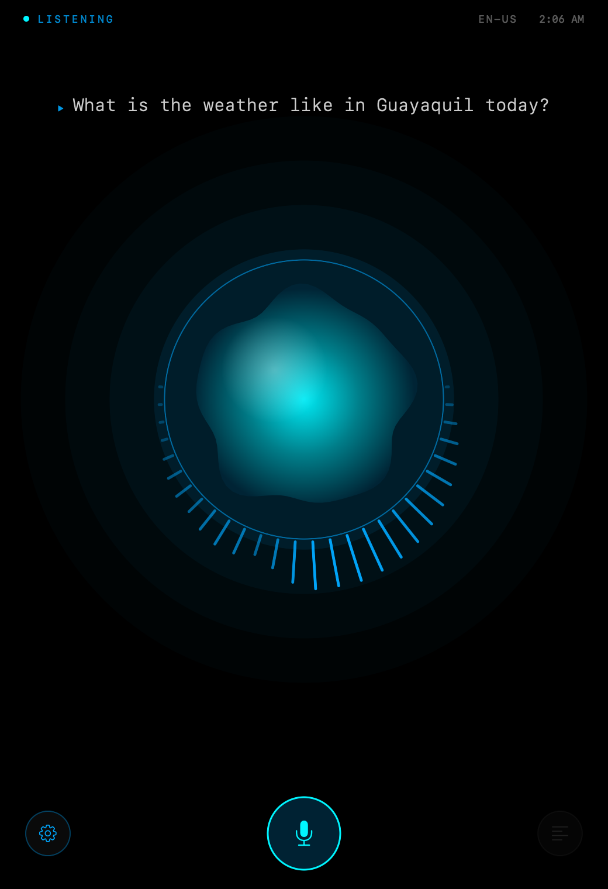
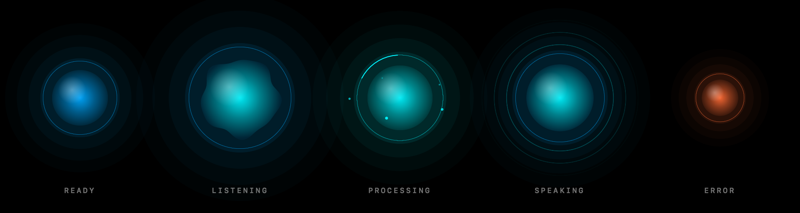
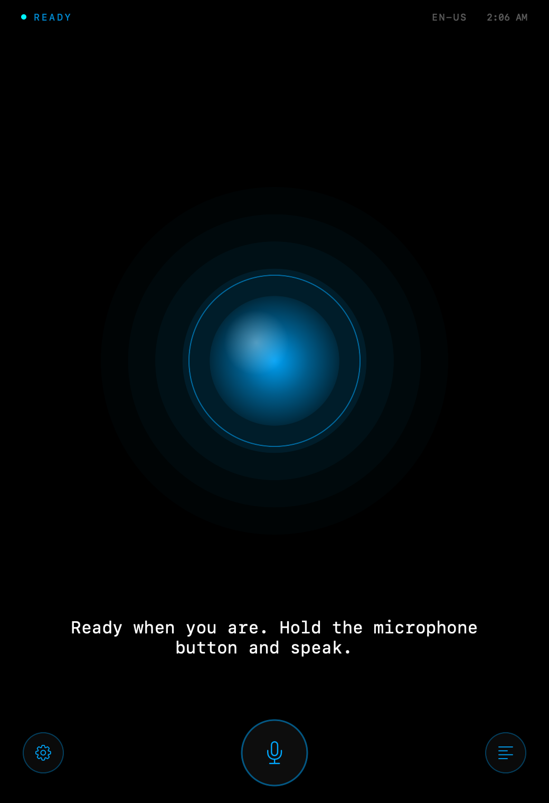
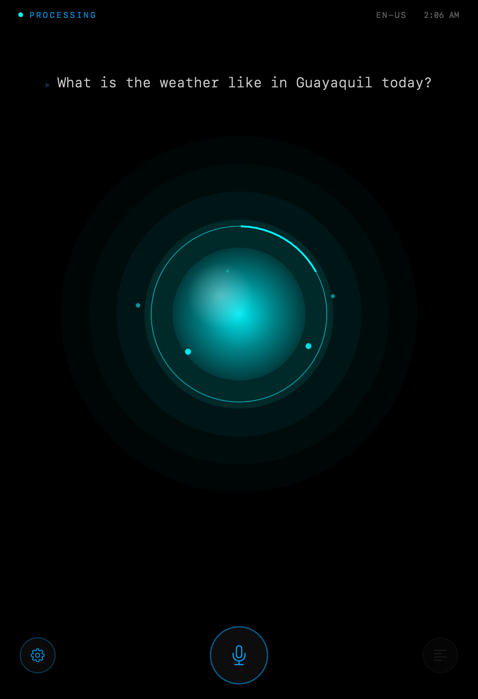
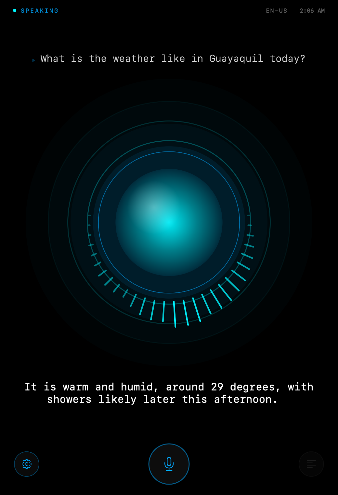
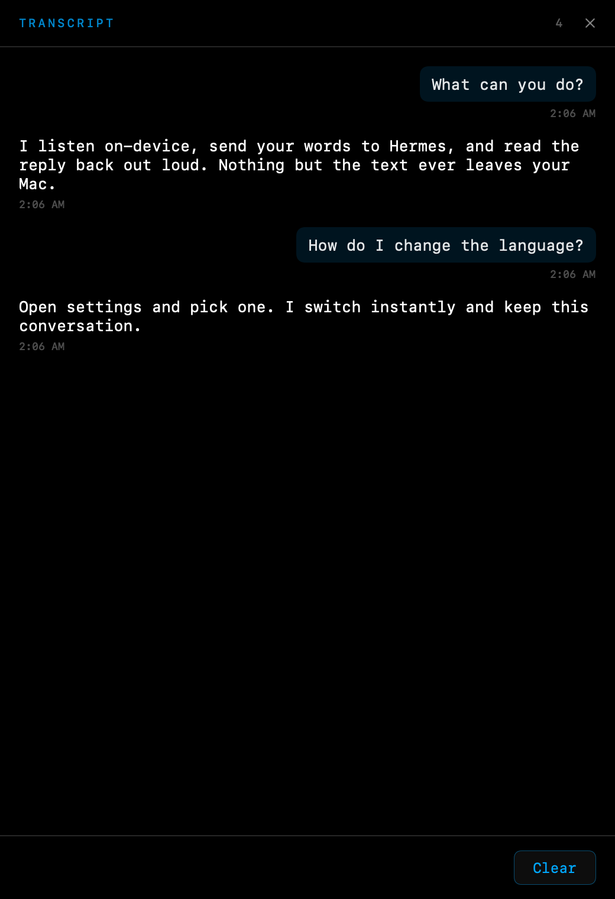

<div align="center">

# HermesVoice

**Talk to Hermes Agent with your voice, in any language.**
Native macOS. Speech in and out runs on your Mac. Zero dependencies.



</div>

---

HermesVoice is a native macOS app, styled after the MCU's J.A.R.V.I.S., that lets you hold
a spoken conversation with any [Hermes Agent](https://github.com/NousResearch) instance —
or any OpenAI-compatible backend.

Speech recognition and speech synthesis both run **on-device**. Your voice never leaves
your Mac; only the transcribed text is sent to the model you point it at. The only thing
you pay for is the LLM itself.

## Features

- **On-device speech recognition** — `SFSpeechRecognizer`, no audio leaves the machine
- **On-device speech synthesis** — `AVSpeechSynthesizer`, using the Siri voices you have installed
- **Any language** — one setting drives recognition, synthesis, *and* the language the
  model replies in. Switchable mid-conversation, without losing the thread
- **Streams as it thinks** — speech starts on the first complete sentence, not after the
  full answer arrives
- **Interruptible** — talk over the reply and it stops, like a real conversation
- **Hands-free mode** — optional voice activity detection instead of push-to-talk
- **Any OpenAI-compatible backend** — Hermes, OpenAI, Ollama, LM Studio
- **Zero dependencies** — Apple frameworks only. No SPM, no CocoaPods, nothing to vendor

## The five states

The orb tells you where you are without reading anything.



| | |
|---|---|
| **Ready** | slow breath, dim blue |
| **Listening** | the rim ripples with what the microphone hears |
| **Processing** | fast pulse, particles orbiting, an arc sweeping the ring |
| **Speaking** | concentric waves, rate following the voice |
| **Error** | contracted, flickering orange |

<table>
<tr>
<td width="33%"></td>
<td width="33%"></td>
<td width="33%"></td>
</tr>
<tr>
<td align="center"><sub>Ready</sub></td>
<td align="center"><sub>Processing</sub></td>
<td align="center"><sub>Speaking</sub></td>
</tr>
</table>

The waveform is a real FFT of the live audio — the microphone while you talk, the
synthesized voice while it answers.

## Conversation history



Slides in from the left. Click any message to copy it.

## Requirements

- macOS 14 (Sonoma) or later
- Xcode 16 or later, to build
- A Hermes Agent instance with the API server enabled — or any OpenAI-compatible endpoint

## Quick start

```bash
git clone https://github.com/devrchancay/hermes-voice-jarvis.git
cd hermes-voice-jarvis
open HermesVoice/HermesVoice.xcodeproj
```

Build and run (⌘R). On first launch the app asks for your server URL and API key.

### No backend handy?

There is a mock server in the repo. Standard library only, nothing to install:

```bash
python3 tools/mock-server.py
```

Then point the app at `http://localhost:8642` with any non-empty API key. It streams a
canned reply in whichever language you have selected, so the whole loop — including a
language switch — works end to end.

## Configuration

Everything lives in the settings sheet, behind the gear button.

| Setting | Stored in |
|---|---|
| Server URL | `UserDefaults` |
| API key | **Keychain** |
| Language | `UserDefaults` |
| Preferred voice, per language | `UserDefaults` |
| Activation mode | `UserDefaults` |

The language picker lists only languages your Mac can both *hear* and *speak* — the
intersection of the installed recognition locales and the installed voices. Languages your
Mac cannot transcribe locally are flagged, because for those the audio does leave the
device.

If a language has no installed voice, the app says so and falls back to text-only rather
than going silent on you. Voices are added in
**System Settings › Accessibility › Spoken Content**.

### Keyboard shortcuts

| | |
|---|---|
| `⌘⇧Space` | Push to talk |
| `⌘↩` | Send |
| `⌘.` | Stop |
| `⌘K` | Clear conversation |

## How it works

```
Microphone ──▶ SFSpeechRecognizer ──▶ HermesClient ──▶ POST /v1/chat/completions
               (on-device)             (SSE)                    │
                                                                ▼
   Speaker ◀── AVSpeechSynthesizer ◀── sentence buffer ◀── streamed tokens
               (on-device)                                      │
                                                                ▼
                                        SwiftUI HUD: orb · waveform · transcript
```

One shared `AVAudioEngine` serves the microphone tap, TTS playback, and metering. That is
what lets the waveform show real output audio, the `stop()` be instant, and barge-in
detection read the same buffers the recognizer does.

The system prompt is written in English and appends a directive naming the reply language:

> Always reply in Japanese, regardless of the language of these instructions.

Keeping the template monolingual is what makes adding a language free — no translation
needed, just a voice your Mac already has.

Full design notes are in [`SPEC.md`](SPEC.md).

## Development

The project was built spec-first, one pull request per task.

- [`SPEC.md`](SPEC.md) — architecture, API contract, UI design
- [`CLAUDE.md`](CLAUDE.md) — working agreement and code conventions
- [`tasks/`](tasks/) — the 15 tasks, each with acceptance criteria

```bash
# Build and test
xcodebuild -project HermesVoice/HermesVoice.xcodeproj -scheme HermesVoice \
  -destination 'platform=macOS' test

# Regenerate the screenshots in this README
tools/screenshots.sh
```

The screenshots above are rendered from the real SwiftUI views with `ImageRenderer`, as
part of the test suite — so they cannot quietly drift out of date with the UI.

## Contributing

Issues and pull requests welcome. Two house rules:

1. **No third-party dependencies.** Apple frameworks only.
2. **No hardcoded languages.** Anything user-facing that assumes one language will be
   sent back.

## License

MIT — see [`LICENSE`](LICENSE).

## Credits

Hermes Agent by [Nous Research](https://nousresearch.com).
Built with [Claude Code](https://claude.ai/code).
